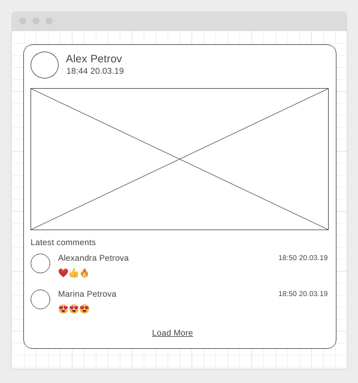

# RxJS

[](https://ci.appveyor.com/project/igor-chazov/ahj-hw-rxjs-posts) [[Github Pages](https://igor-chazov.github.io/ahj-hw-rxjs-posts)]

---

## Posts with comments

### Легенда

Вы работаете в компании, занимающейся созданием социальной платформы. А конкретно ваша команда - занимается блоком, связанным с лентой последних постов. Соответственно, вам нужно грузить список последних постов, а поскольку платформа всё-таки социальная, к каждому посту список последних комментариев.

Понятное дело, что по-хорошему, нужно чтобы с сервера приходили посты сразу со списком последних комментариев, но пока разработчики сервеной части упёрлись и сказали, что всё будет отдельно, а именно:
* получение списка последних постов
* получение последних комментариев к конкретному посту по id

### Описание

#### Серверная часть

Как всегда, у разработчиков серверной части ещё ничего не готово, и чтобы не ждать их, вам нужно разработать демо REST-сервер со следующими endpoint'ами:
* GET /posts/latest - список последних постов (не более 10) в формате:
```json
{
  "status": "ok",
  "data": [
    {
      "id": "<id>",
      "author_id": "<author_id>",
      "title": "<title>",
      "author": "<author>",
      "avatar": "<avatar>",
      "image": "<url>",
      "created": "<timestamp>"
    },
    ...
  ]
}
```
* GET /posts/\<post_id\>/comments/latest - список последних комментариев к посту (не более 3) в формате:
```json
{
  "status": "ok",
  "data": [
    {
      "id": "<id>",
      "post_id": "<post_id>",
      "author_id": "<author_id>",
      "author": "<author>",
      "avatar": "<avatar>",
      "content": "<content>",
      "created": "<timestamp>"
    },
    ...
  ]
}
```

Для генерации данных можете использовать данные с [jsonplaceholder](https://jsonplaceholder.typicode.com) или библиотеку [faker](https://www.npmjs.com/package/faker)

#### Клиентская часть

С использованием библиотеки rxjs организуйте получение данных о постах и загрузки для каждого поста комментариев так, чтобы в `subscribe` получать уже посты с комментариями (используйте для этого соответствующие операторы).

Общий вид одного поста:



Функциональность кнопки "Load More" реализовывать не нужно.

---